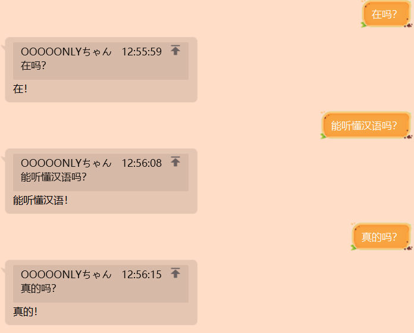

# 安装

## 单独运行

1. 配置 java 环境

2. 编译或下载最新版本 [lua-mirai-executable-all.jar](https://github.com/only52607/lua-mirai/releases)

3. 在 jar 目录下，创建 ai.lua 文件，并填入以下代码。（注意填写账号密码）

```lua
Event.subscribe("FriendMessageEvent", function(event)
    local reply = tostring(event.message):gsub("吗",""):gsub("?","!"):gsub("？","！")
    event.friend:sendMessage(Quote(event.message) .. reply)
end)

-- 在mirai-console环境下可忽略下列代码
local bot = Bot(账号,"密码")
bot:login()

```

4. 查看效果


## 作为MiraiConsole插件运行

1. 编译或下载最新版本[mirai console](https://github.com/mamoe/mirai-console)

2. 配置[mirai console](https://github.com/mamoe/mirai-console)环境，并将jar放入[mirai console](https://github.com/mamoe/mirai-console)插件目录。

### 基本概念

脚本源：脚本源指脚本的来源，可以是一个文件，或者指向脚本内容的URL。

脚本：脚本由脚本源创建而来，代表一个正在运行的脚本。

脚本源和脚本的关系：脚本源是创建脚本的来源，一个脚本源可以对应多个正在运行的脚本，每个脚本都由一个脚本源创建。类似于面向对象中的类与对象的关系。

### 基本命令
使用/lua help 可查看所有可用命令
```
/lua source add <文件名或URL>    # 新增脚本源
/lua doc    # 打开lua mirai开发文档
/lua script info <脚本编号>    # 查看运行中的脚本信息
/lua source list    # 列出所有脚本源
/lua script list    # 列出运行中的脚本
/lua source remove <索引>    # 删除指定位置上的脚本源
/lua script restart <脚本编号>    # 重新读入脚本源以启动脚本
/lua script start <脚本源编号>    # 使用脚本源启动一个新脚本
/lua script stop <脚本编号>    # 停用一个运行中的脚本（该操作会停止脚本以及脚本内注册的所有事件监听器）
```

示例:

新增一个脚本源，具体为test.lua，并使用此脚本源构建一个脚本
```
/lua source add test.lua
/lua script start 0
```

> 下载mirai-console集成版[lua-mirai-executable-mcl-all.jar](https://github.com/only52607/lua-mirai/releases)可免除配置步骤


## 作为项目依赖

### Gradle

[](https://www.jitpack.io/#only52607/lua-mirai)

添加 jitpack 仓库

``` groovy
buildscript{
    repositories {
        maven { url 'https://jitpack.io' }
    }
}
```

添加 mirai 以及 lua-mirai 依赖

```groovy
dependencies {
    implementation "com.github.only52607:lua-mirai:$LUAMIRAI_VERSION" 
}
```


## 在安卓上使用

[LuaMiraiForAndroid](https://github.com/only52607/LuaMiraiForAndroid)是lua-mirai在Android端的运行方案，具有高度可操作性，提供了强大的多Bot管理及构建参数完全控制和脚本可视化管理功能，强烈建议使用[LuaMiraiForAndroid](https://github.com/only52607/LuaMiraiForAndroid)作为Android端的运行环境。